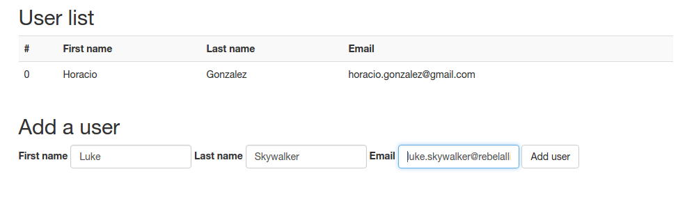

## example-polymer-array-binding

A quick example of array data binding on Polymer





## How to test

1. Clone or download this repository

1. Install `bower` and `polyserve` if needed

  ```
  $ npm install -g bower polyserve
  ```
  
1. Recover dependencies via bower

  ```
  $ bower install
  ```
  
1. Run polyserve

  ```
  $ polyserve 
  Starting Polyserve on port 8080
  Files in this directory are available under http://localhost:8080/components/example-polymer-array-binding/   
  ```
  
  